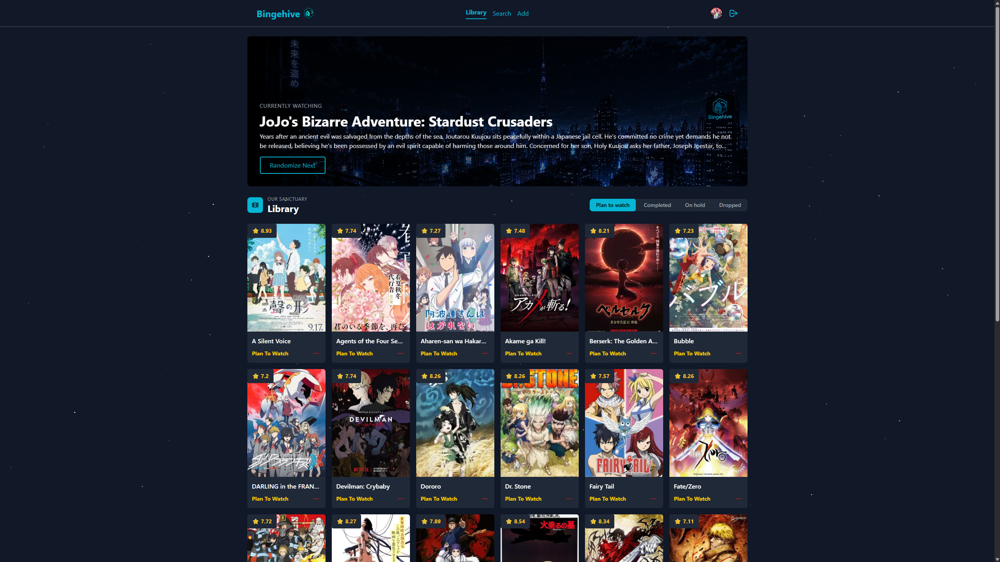

# Hey, I'm Hannes 👋

I'm a web developer from Värmland, Sweden — graduated in the summer of 2026. My passion lives at the intersection of UI/UX design and development, and I enjoy building things that both look great and work well under the hood.

When I'm not coding, I'm on the tennis court coaching adults and high school students.

---

## About Me

My journey into tech started about 10 years ago when I built my first gaming PC and fell in love with computer hardware. That curiosity quickly expanded into software — and eventually into programming.

The spark for UI/UX came from an unexpected place: World of Warcraft. I started designing custom UIs for myself and friends to improve the in-game experience, and the more I worked on them, the more I became fascinated with interface design. That fascination eventually led me to pursue a career in web development.

These days I focus on building clean, responsive frontends with React and TypeScript, while also being comfortable setting up solid backends when needed — most recently with Python and FastAPI.

---

## Images

## Tech Stack

### Frontend

### Backend

### Database & Cloud

### Tools & Design

